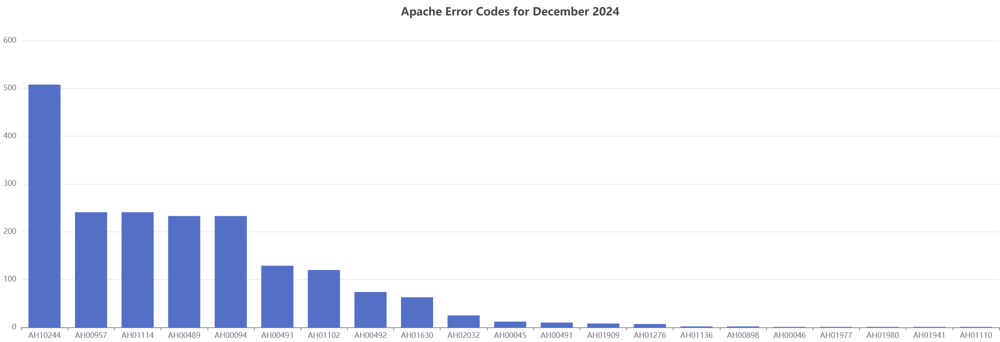

## Http Log Management and Visualization Application

### Express handles data Querying & ECharts handles data Visualization of the MySQL http_logs Schema

MySQL2ApacheECharts is a Web interface that consists of [Express.js](https://github.com/expressjs/express)
 with [W2UI](https://github.com/vitmalina/w2ui) drill-down data grids & 
[Apache ECharts](https://github.com/apache/echarts) for Log Data Visualization in charts, reports & data analysis 
interfaces for MySQL or MariaDB database 
created by [mysql-schema-http-logs](https://github.com/willthefarmer/mysql-schema-http-logs) and populated by [http-logs-to-mysql](https://github.com/willthefarmer/http-logs-to-mysql) that started as a Python script to LOAD DATA as the database design took shape.