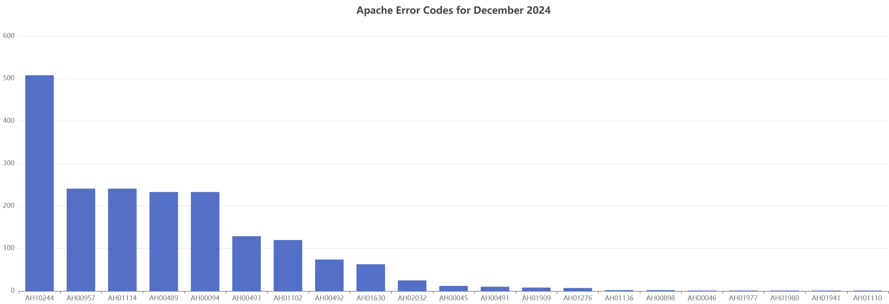

# mysql-to-apache-echarts
Web Interface with Drill Down Capability and [apache/echarts](https://github.com/apache/echarts) Log Visualization integration 
for MySQL apache_logs Schema created by [WillTheFarmer/apache-logs-to-mysql](https://github.com/willthefarmer/apache-logs-to-mysql).

